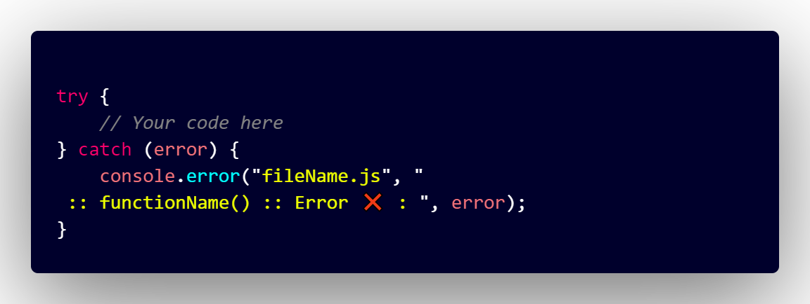

# Try-Catch Error Snippet Extension

## Overview

Writing effective try-catch error messages in large projects is crucial, but it can be challenging to ensure proper error handling across codebases. Our VS Code extension simplifies this process significantly. It streamlines the creation of try-catch blocks and automatically includes the current file name and parent function in the error message. This feature helps developers quickly identify where an issue occurred, making debugging more efficient in complex projects.

## Key Features

- **Automatic Context Detection:** Automatically identifies the current file name and attempts to detect the parent function where the error occurs.
  
- **Improved Error Messages:** Formats error messages to include "FileName.js" or "FileName.ts" and "FunctionName()" (if available), alongside detailed error information.

- **Effortless Integration:** Insert try-catch blocks quickly using the command palette (Ctrl+Shift+P) or directly with the shortcut Ctrl+Alt+T (Windows) or Cmd+Alt+T (Mac).

## Quick Start

### Installation

Install the extension from the Visual Studio Code Marketplace or search for "Try-Catch Error Snippet" in the Extensions view (Ctrl+Shift+X).

### Inserting a Try-Catch Block

1. Place your cursor within the function where you want to handle errors.
2. Use the command palette (Ctrl+Shift+P) and type "TCES" to insert the snippet.
3. Alternatively, use the shortcut Ctrl+Alt+T to directly insert the try-catch block.

### Snippet Format

The inserted try-catch block follows this format:



- **FileName.js** or **FileName.ts** dynamically represents your actual file name.
- **FunctionName()** dynamically represents the name of the function where the try-catch block is inserted, providing crucial context in the error message.
- Error details are displayed in the console for quick reference.

### Example

<video width="600" autoplay loop muted playsinline>
  <source src="media/mediaFiles/ReadmeMedia/VSCodeExtension.mp4" type="video/mp4">
  Your browser does not support the video tag.
</video>


## Language Support

### Fully Supported Languages

- **JavaScript (.js)** and **TypeScript (.ts):** Fully supported with automatic detection of file name and parent function for error messages.

### Basic Support (Prints Try-Catch with File Name)

For the following languages, extension is able to write Try-Catch snippet in respective syntax **without** detecting the parent function,

- Java, Python, C, C++, Ruby, PHP, Swift, Kotlin, Rust, Go, Scala, Perl, Objective-C, Haskell, Lua, Dart, Erlang, Groovy, Visual Basic (VB)

The full support for all these languages will also be there soon.


## Known Issues and Future Updates

- The extension fully supports JavaScript (.js) and TypeScript (.ts) files for generating try-catch error snippets. For other languages like Java, Python, C, C++, and more, the extension provides basic support for try-catch snippets but does not yet detect parent functions.

- Other bugs are being actively addressed in upcoming updates. Your feedback is invaluable!

## Contribution Guide

We welcome contributions to improve the extension! Here's how you can get started:

1. **Clone the Repository:**

```sh
git clone <repository-url>
cd try-catch-error-snippet

```


2. **Install `vsce` (Visual Studio Code Extension Manager):**
If you haven't already, install `vsce` globally to package and publish extensions.

```sh
git clone <repository-url>
cd try-catch-error-snippet

```


3. **Start Coding:**
Make your changes, test them thoroughly, and submit a pull request. We appreciate your efforts in enhancing this tool for the community!
